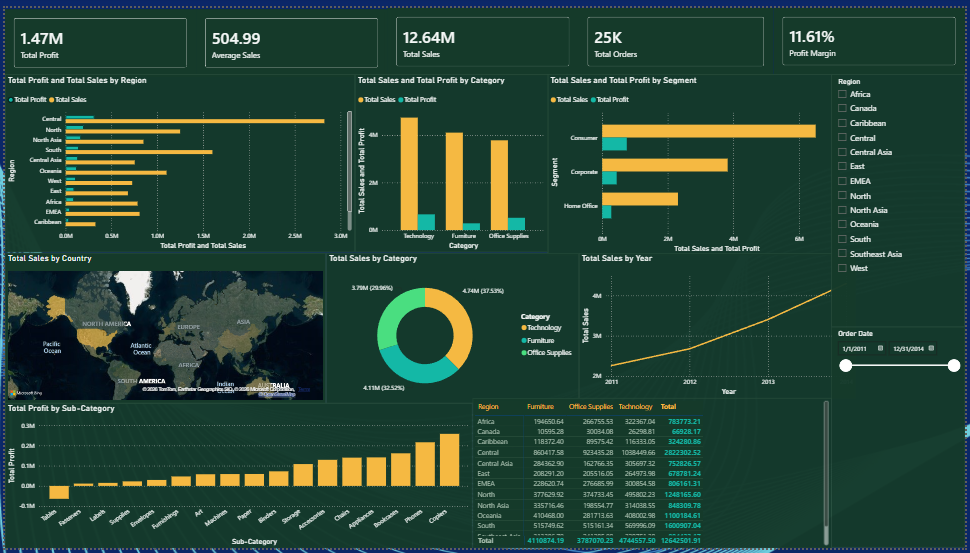

# Global Superstore, Sales & Profit BI Dashboard

**AnalystLab Africa | Data Analytics Internship Programme | Week 2**
Business Intelligence & Interactive Dashboard Development

---

## 📊 Project Overview

An executive Power BI dashboard built for a national retail company, giving senior management visibility into sales performance, profitability, customer behaviour, and regional performance across 51,290 order line records (2011–2014, 147 countries).

---

## 🎯 Business Questions Answered

1. What is the overall sales performance of the company?
2. Which regions generate the highest sales and profit?
3. Which customer segments contribute the most revenue?
4. Which product categories perform best?
5. Which products are the most profitable?
6. What trends can be observed over time?
7. What recommendations should management implement?

---

## 🔑 Key Findings

- **Tables is the only unprofitable sub category**, –$64,083 profit on $757K sales.
- **Technology has the strongest margin** (~14%) of any category.
- **Southeast Asia has a volume to margin mismatch**, $884K sales, only ~2% margin.
- **Consumer segment drives the most revenue** ($6.5M) with no profit red flags.
- **Sales nearly doubled 2011→2014**, with a predictable February dip and November peak.

Full detail: [`reports/Insights_Recommendations.docx`](reports/Insights_Recommendations.docx)

---

## 🛠️ Tech Stack

- **Microsoft Power BI Desktop**, data modelling, DAX measures, dashboard build
- **Power Query**, data cleaning and transformation
- **Python (pandas)**, initial data quality checks and cross validation
- **Microsoft Excel**, supplementary formula driven summary workbook

---

## 📁 Repository Structure

| Folder | Contents |
|---|---|
| `dashboard/` | Power BI project file (.pbix), PDF export, dashboard screenshot |
| `data/` | Cleaned source dataset |
| `reports/` | BI Overview Report, Insights & Recommendations, Executive Summary |
| `docs/` | Full project change log (every data cleaning and design decision, with reasoning) |

---

## 📈 Dashboard Contents

- **5 KPI Cards**: Total Sales, Total Profit, Total Orders, Average Sales, Profit Margin
- **9 Visualisations**: 2 bar charts, 2 column charts, 1 line chart, 1 donut chart, 1 map, 1 matrix
- **2 Slicers**: Region, Order Date (range)

---

## 📝 Methodology Note

Every data cleaning decision, chart choice, and formatting fix in this project is documented, with the reasoning behind it, in [`docs/Project_Log.md`](docs/Project_Log.md). This includes catching and correcting a mid project cross filtering bug where dashboard totals briefly didn't match the source data, verified and fixed against an independent Python calculation.

---

## 👤 Author

Built as part of the AnalystLab Africa Data Analytics Internship Programme.

`#AnalystLabAfrica`
